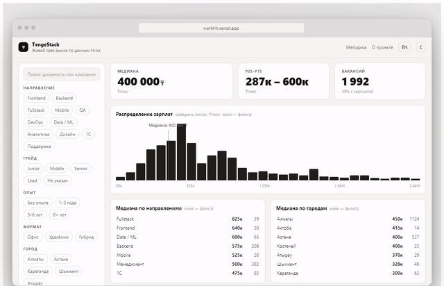

🇬🇧 English · [🇷🇺 Русский](README.ru.md)

# TengeStack — IT salaries in Kazakhstan

A live dashboard of the Kazakhstan IT salary market built from open job postings on hh.kz.
Medians by role, grade and city · in-demand technologies · every filter state is shareable
as a URL · works offline (PWA).

**Live:** https://workhh.vercel.app



**Methodology:** `/methodology` page in the app · RU / EN interface

> Data is read from the public search pages of hh.kz (see "Where the data comes from").
> For offline local development there is a synthetic fixture — `pnpm data:fixture`; it marks
> the dataset with a `synthetic` flag and the UI shows a "demo data" banner.

---

## Why

Developers in Kazakhstan negotiate blind: salary surveys come out once a year, are stale by
the time they are published, and hide the raw numbers behind gated PDFs. TengeStack keeps a
live snapshot of open vacancies, refreshed automatically, and openly documents which parts of
the data should not be trusted.

## Features

- Median salary and percentiles by role, grade (seniority) and city
- Most requested skills, extracted from vacancy titles and snippets with a curated dictionary
- Filters synchronised with the URL (`history.replaceState`, no router) — any slice can be shared as a link
- Custom SVG charts (no charting library) with keyboard-focusable histogram bins
- Virtualised vacancy table (`@tanstack/react-virtual`)
- Offline support: a hand-written service worker with stale-while-revalidate for the dataset
- RU / EN interface toggle, "Methodology" and "About" pages
- Synthetic, seeded fixture for development without network access (clearly flagged in the UI)

## Architecture

```
┌────────────── daily (GitHub Actions cron) ─────────────┐
│ scripts/scrape.ts   hh.kz search pages → data/raw/YYYY-MM-DD.jsonl │
│ scripts/build-dataset.ts                                           │
│   freshness window → dedupe by id → normalise →                    │
│   columnar packing → public/data/dataset.json + meta.json          │
└──────────────────────────┬─────────────────────────────┘
                           ▼
            static hosting (Vercel, no backend)
                           ▼
┌────────────────────── browser ──────────────────────────┐
│ snapshot download with progress                          │
│ filter engine: one pass over columns → Uint32Array       │
│ KPI · SVG charts · virtualised table                     │
│ filters ⇄ URL (history.replaceState, no router)          │
│ service worker: SWR for the dataset → offline            │
└─────────────────────────────────────────────────────────┘
```

**There is no server at all.** The dataset is a static snapshot; all analytics (filters,
medians, percentiles, histograms) are computed in the browser.

Front-end layout is FSD-light: `entities/` (domain: vacancy types, codec, stats) →
`features/` (filters, dashboard selectors) → `widgets/` (Charts, KpiRow, VacancyTable, Header)
→ `app/` (Next.js App Router pages). Shared helpers (formatting, i18n, UI primitives) live in
`shared/`.

## Key decisions and trade-offs

| Decision | Cost | Why it is still worth it |
|---|---|---|
| **Columnar format + dictionaries** instead of an array of objects | a custom codec (plus tests) | several times smaller than row-JSON after gzip; filters run without allocating objects; skills stored CSR-style like a sparse matrix |
| **Static snapshot** instead of an API | data is refreshed once a day, not in real time | salary aggregates do not need real time; hosting is free; offline comes for free |
| **Filters on the main thread**, no web worker | theoretical ceiling | a single pass over the columns is linear in n and fast enough for the current dataset size; a worker would spend the complexity budget in the wrong place |
| **Own SVG charts** instead of recharts/d3 | no ready-made axes/legends | no charting library in the bundle; full control over a11y (bins are focusable buttons) |
| **Skills from snippets** via a dictionary, not from `key_skills` | undercounts skills in long job descriptions | `key_skills` would cost one extra request per vacancy; snippets cover most mentions; the limitation is documented in the methodology |
| **No gross/net tax normalisation** | some noise in medians | applying an income-tax formula to salary *ranges* would give false precision; the `gross` flag is kept as a column |
| **Names in the URL**, not dictionary indices | longer URLs | links survive dataset rebuilds |
| **Grade "1–3 years" without a seniority word in the title → unknown** | some rows have no grade | more honest than labelling everyone as junior and skewing grade medians |

## Data pipeline

The pipeline is a set of Node scripts (run with `tsx`) in `scripts/`:

| Script | Command | What it does |
|---|---|---|
| `scripts/scrape.ts` | `pnpm data:scrape` | Scrapes public hh.kz search pages (area = Kazakhstan) for a fixed list of IT professional roles × experience levels over the last 30 days. Each page embeds a JSON state (`HH-Lux-InitialState`) with structured vacancies — salary (with `gross` flag and currency), experience, work format, role — so the parser reads JSON, not HTML markup. The ~2000-results depth limit is bypassed by splitting the date interval in half recursively. Polite by default: 1.2 s between requests, a single browser User-Agent, retries and anti-bot page detection. Writes `data/raw/YYYY-MM-DD.jsonl`. |
| `scripts/fetch.ts` | `pnpm data:fetch` | Alternative loader via the official HH API (requires app credentials in `.env`, see `.env.example`). Same role × experience × date-splitting strategy. |
| `scripts/build-dataset.ts` | `pnpm data:build` | Reads `data/raw/*.jsonl`, keeps only snapshots inside a freshness window (`FRESH_DAYS`, default 1 = latest snapshot only), dedupes by vacancy id (newest wins), normalises salaries to KZT using fetched FX rates, infers role / grade / work mode, extracts skills, and packs everything columnar into `public/data/dataset.json` plus `public/data/meta.json`. |
| `scripts/make-fixture.ts` | `pnpm data:fixture` | Generates a seeded (mulberry32) synthetic `synthetic-*.jsonl` fixture with fictional employers; `build-dataset` uses it only when no real snapshot exists and marks the dataset `synthetic: true`. |
| `scripts/make-icons.ts` | `pnpm icons` | Renders PWA icons with `sharp`. |

`pnpm data:refresh` = `data:scrape` + `data:build`.

Shared pipeline modules live in `scripts/lib/` (`hh.ts` API client, `scrape.ts` page scraper,
`salary.ts`, `skills.ts`, `taxonomy.ts`).

**Automation.** `.github/workflows/refresh-data.yml` runs daily (cron `0 19 * * *`, i.e. 00:00
Almaty time) and on manual dispatch: scrape → build → prune raw snapshots to the last three →
commit `data/raw` and `public/data` back to the repository. `vercel.json` rewrites `/data/*` to
the raw files of the `main` branch on GitHub, so a fresh dataset reaches the deployed PWA
without a redeploy.

### Where the data comes from

HH closed anonymous access to its API (403), and an application token requires manual
moderation. That is why `data:scrape` reads the **public search pages of hh.kz** anonymously,
without logging in.

> **CI note.** Scraping from a residential IP is stable. GitHub Actions runners use
> data-centre IPs which hh.kz may throttle harder; if the scheduled workflow starts hitting
> 403 / captcha pages, the fallback is to run `pnpm data:refresh` locally and commit the
> snapshot. The parser detects anti-bot pages and retries.

A full breakdown of biases and limitations is on the **Methodology** page in the app.

## Stack

Next.js 15 (App Router, static export) · React 19 · TypeScript strict · SCSS Modules ·
custom SVG charts · @tanstack/react-virtual · Node data pipeline (tsx) · Vitest ·
GitHub Actions (CI + daily data refresh) · PWA (hand-written service worker) · pnpm.

## Run locally

Requires Node 22 and pnpm (`packageManager` is pinned in `package.json`).

```bash
pnpm install
pnpm data:refresh   # scrape hh.kz + build the snapshot (several minutes, polite rate limit)
pnpm dev
```

For offline / no-network work use the synthetic fixture:

```bash
pnpm data:fixture && pnpm data:build   # dataset flagged synthetic + banner in the UI
```

Other scripts:

```bash
pnpm build       # next build (static export)
pnpm start       # next start
pnpm typecheck   # tsc --noEmit
```

The optional HH API path (`pnpm data:fetch`) needs `HH_CLIENT_ID` / `HH_CLIENT_SECRET` or
`HH_APP_TOKEN` in `.env` — see `.env.example`. `.env` is git-ignored.

## Tests / CI

Unit tests (Vitest, `tests/*.test.ts`) cover the dataset codec, filter engine, salary
normalisation, scraper parsing, skill extraction, statistics and taxonomy:

```bash
pnpm test         # vitest run
pnpm test:watch
```

`.github/workflows/ci.yml` runs on every push to `main` and on pull requests:
`pnpm install --frozen-lockfile` → `pnpm typecheck` → `pnpm test` → `pnpm build`.

## Author

**Alexander Kurchakov** — Frontend + UX/UI, Almaty ·
[GitHub](https://github.com/Alexanderadon)

## License

MIT — see [LICENSE](LICENSE). The data belongs to its source (hh.kz); the project aggregates
only publicly available information and stores no personal data.
